# SeedSigner localization (experiment)

This branch includes seedsigner localization experiment. As an example, I added Korean localization updates, but other foreign languages can also be added later.

Language can be changed in Settings/Advanced/Langugage setting and the settings will be stored in settings.json which is default setting file of seedsigner.

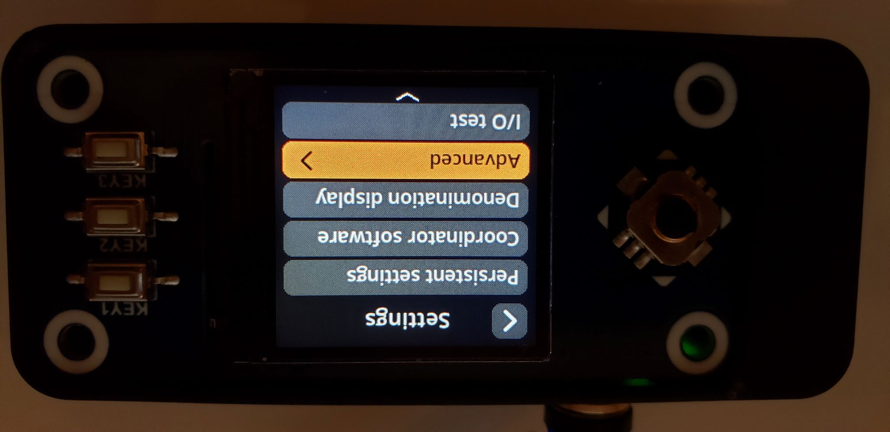

New menu "Language" will be shown in Advanced settings:

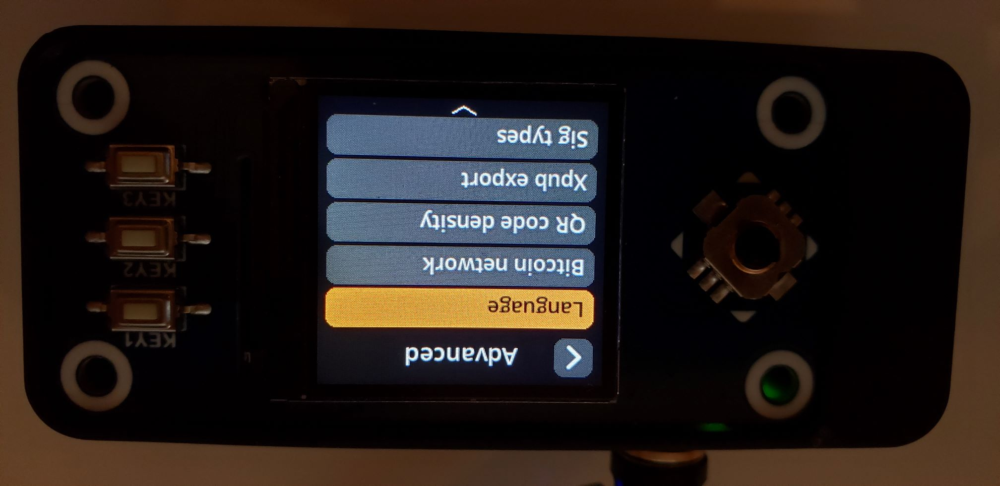

Language change will require system rebooting and its warning message will be shown as below. (Since the Language setting will be stored in Settings.json file in SD card, if Persistent Settings option is disabled, it will show 'Persistent required' warning screen and will go back to Advanced Settings screen.)

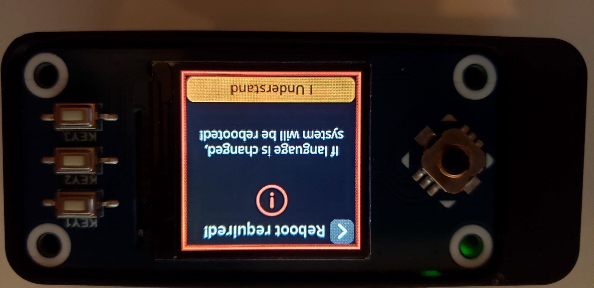

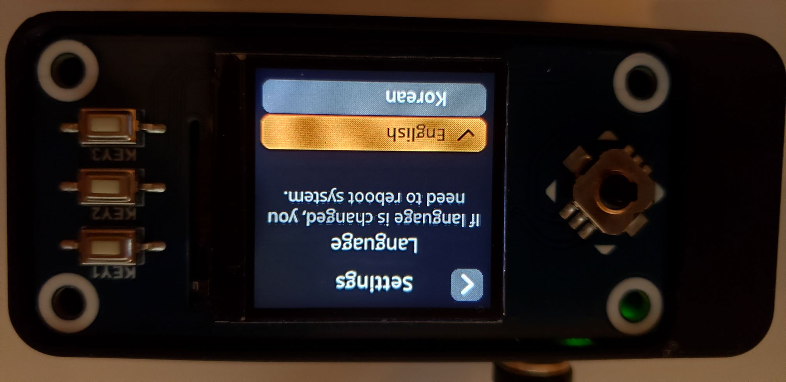

If language is changed, Reboot/PowerOff screen will be shown without Back button: 

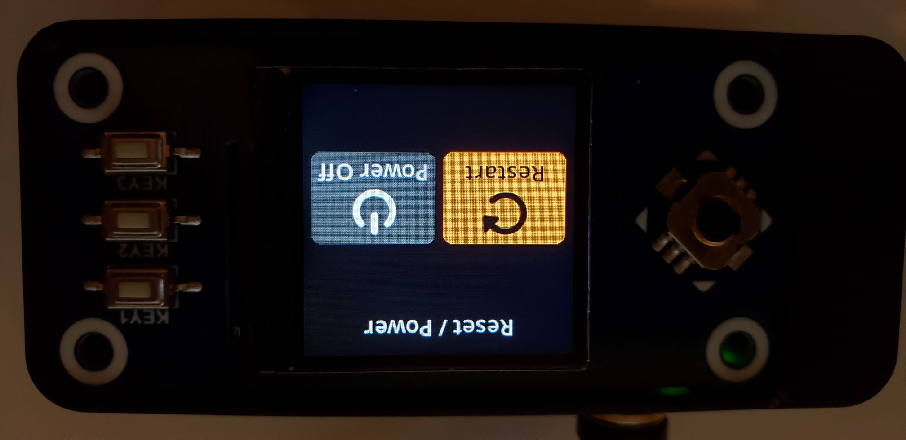

### Localization approach
This localization experiment is using GNU gettext API and its localization files are located under src/seedsigner/locales/ folder.

I wanted to minimize the code changes and achieve localization simultaneously, which led me to make a trade-off by giving up the runtime Language setting. So when language is changed, system reboot is required.

# Korean version of SeedSigner

As a localization example, there is a Korean translation in src/seedsigner/locales/ko/LC_MESSAGES folder. 

Here are some UI samples of Korean localization.

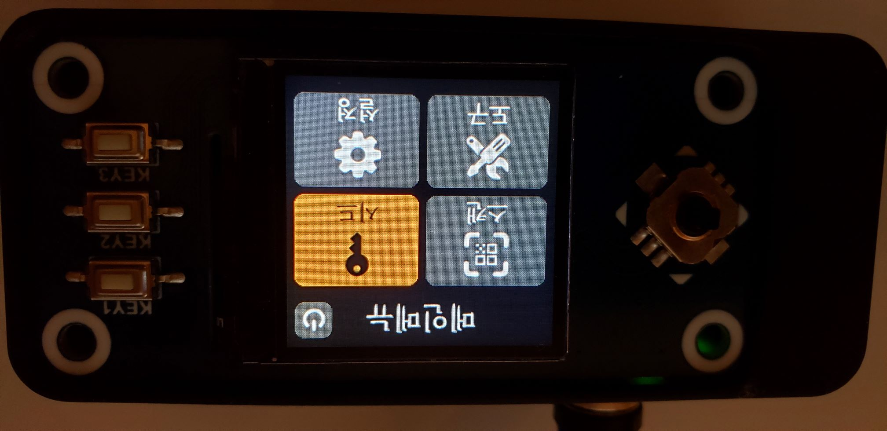

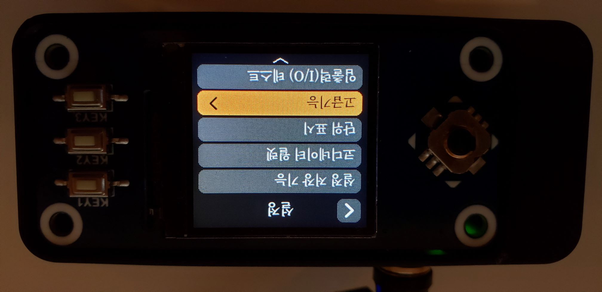

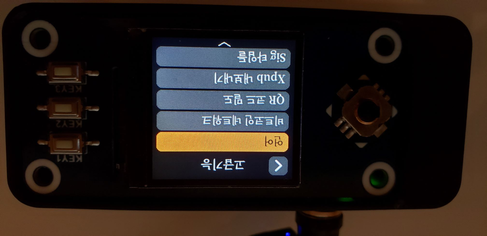

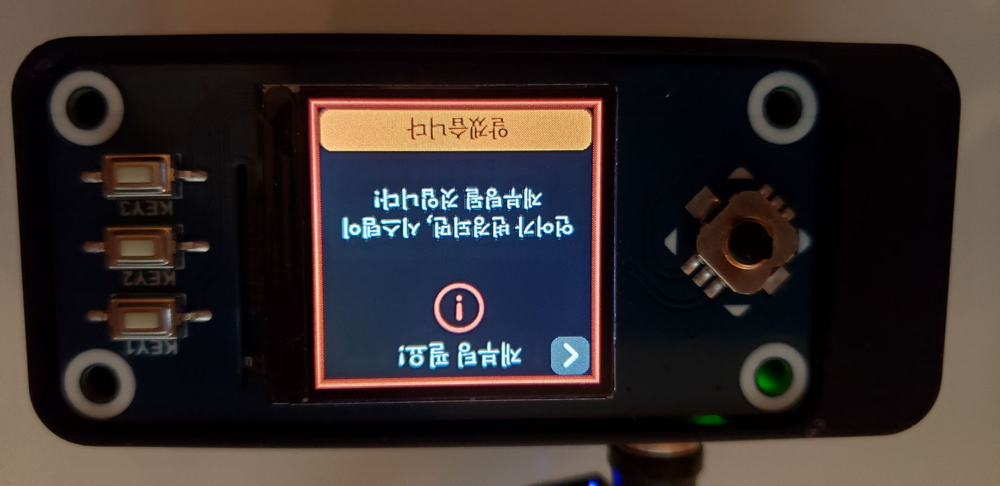

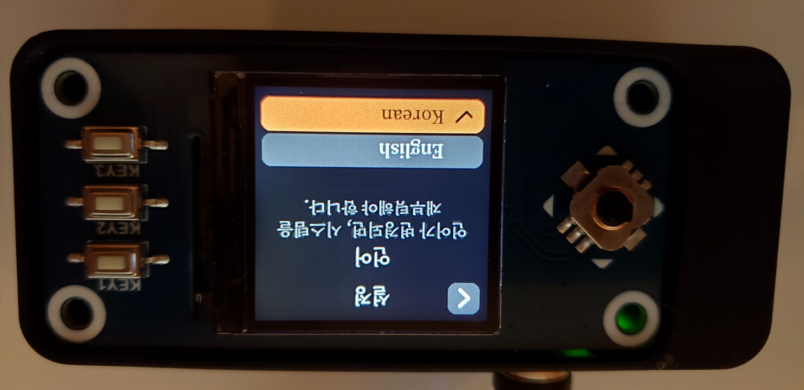

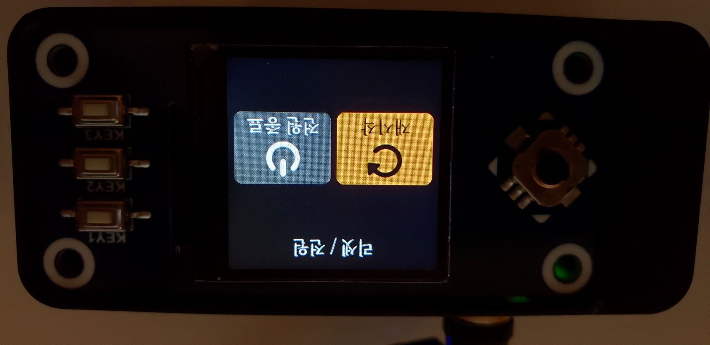

